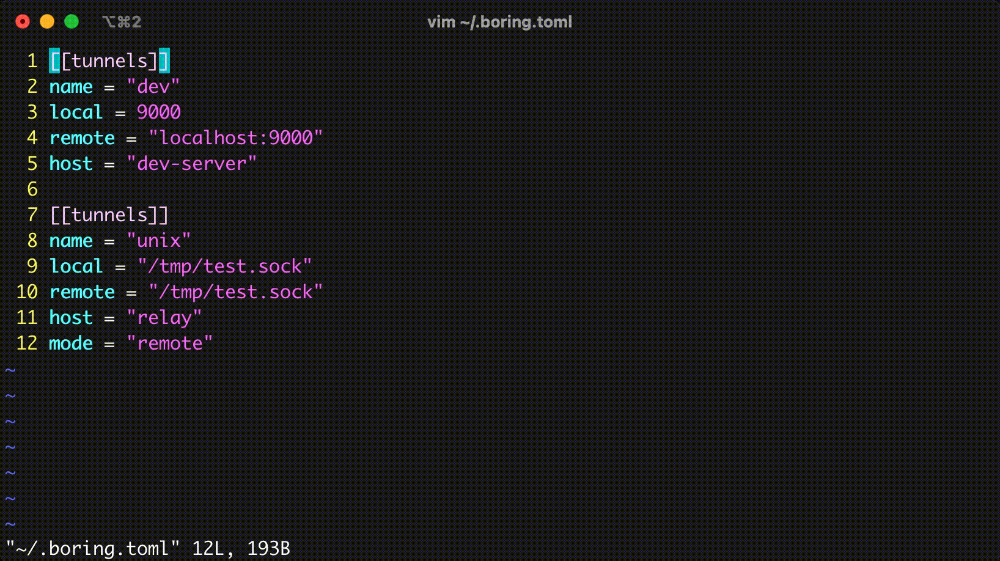

# The `boring` tunnel manager

  [](https://goreportcard.com/report/github.com/alebeck/boring)
 

A simple command line SSH tunnel manager that just works.



## Features
* Ultra lightweight and fast
* Local, remote and dynamic (SOCKS5) port forwarding
* Compatible with SSH config and `ssh-agent`
* Supports Unix sockets
* Automatic reconnection and keep-alives
* Human-friendly configuration via TOML

## Usage
```
Usage:
  boring list, l                List all tunnels
  boring open, o (-a | <patterns>...)
    <patterns>...               Open tunnels matching any glob pattern
    -a, --all                   Open all tunnels
  boring close, c               Close tunnels (same options as 'open')
  boring edit, e                Edit the configuration file
```

## Configuration
By default, `boring` reads its configuration from `~/.boring.toml` on macOS and Windows, and from `$XDG_CONFIG_HOME/boring/.boring.toml` on Linux. If `$XDG_CONFIG_HOME` is not set, it defaults to `~/.config`. The location of the config file can be overriden by setting `$BORING_CONFIG`. The config is a simple TOML file describing your tunnels:

```toml
# simple tunnel
[[tunnels]]
name = "dev"
local = "9000"
remote = "localhost:9000"
host = "dev-server"  # automatically matches host against SSH config

# example of an explicit host (no SSH config)
[[tunnels]]
name = "prod"
local = "5001"
remote = "localhost:5001"
host = "prod.example.com"
user = "root"
identity = "~/.ssh/id_prod"  # will try default ones if not set

# ... more tunnels
```

Currently, supported options are:

| **Option**    | **Description**                                                                                                     |
|---------------|---------------------------------------------------------------------------------------------------------------------|
| `name`        | Alias for the tunnel. **Required.**                                                                                 |
| `mode`        | Mode of the tunnel. Can be either `"local"`, `"remote"`, `"socks"` or `"socks-remote"`. Default is `"local"`.       |
| `local`       | Local address. Can be a `"$host:$port"` network address or a Unix socket. Can be abbreviated as `"$port"` in local and socks modes. **Required** in local, remote and socks modes. |
| `remote`      | Remote address. As above, but can be abbreviated in remote and socks-remote modes. **Required** in local, remote and socks-remote modes. |
| `host`        | Either a host alias that matches SSH configs or the actual hostname. **Required.**                            |
| `user`        | SSH user. If not set, tries to read it from SSH config, defaulting to `$USER`.                                       |
| `identity`    | SSH identity file. If not set, tries to read it from SSH config and `ssh-agent`, defaulting to standard identity files.     |
| `port`        | SSH port. If not set, tries to read it from SSH config, defaulting to `22`.                                          |


## Installation

### Homebrew
```sh
brew install boring
```

### Pre-built
Get one of the pre-built binaries from the [releases page](https://github.com/alebeck/boring/releases). Then move the binary to a location in your `$PATH`.

### Build yourself
```sh
git clone https://github.com/alebeck/boring && cd boring
./build.sh
```

Then move the binary to a location in your `$PATH`.

<details>
  <summary>Note for Windows users</summary>
  Windows is fully supported since release 0.6.0. Users currently have to build from source, which is very easy. Make sure Go >= 1.23.0 is installed and then compile via

  ```batch
  git clone https://github.com/alebeck/boring && cd boring
  .\build_win.bat
  ```

  Then, move the executable to a location in your `%PATH%`.
</details>

### Shell completion
Shell completion scripts are available for `bash`, `zsh`, and `fish`. 

If `boring` was installed via Homebrew, and you have Homebrew completions enabled, nothing needs to be done. 

Otherwise, install completions by adding the following to your shell's config file:

#### Bash
```sh
eval "$(boring --shell bash)"
```

#### Zsh
```sh
source <(boring --shell zsh)
```

#### Fish
```sh
boring --shell fish | source
```
