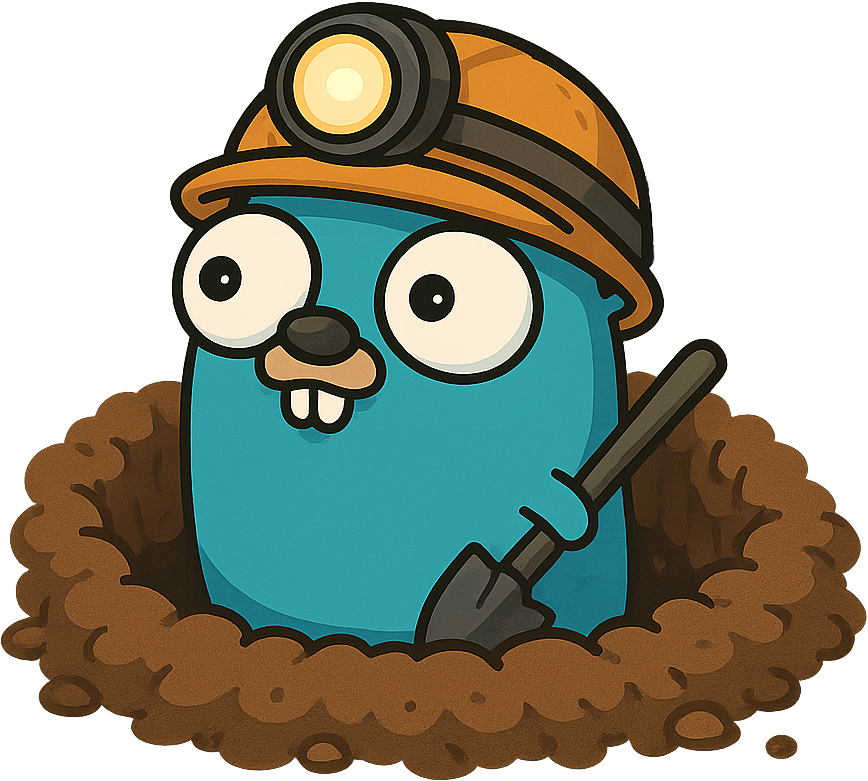
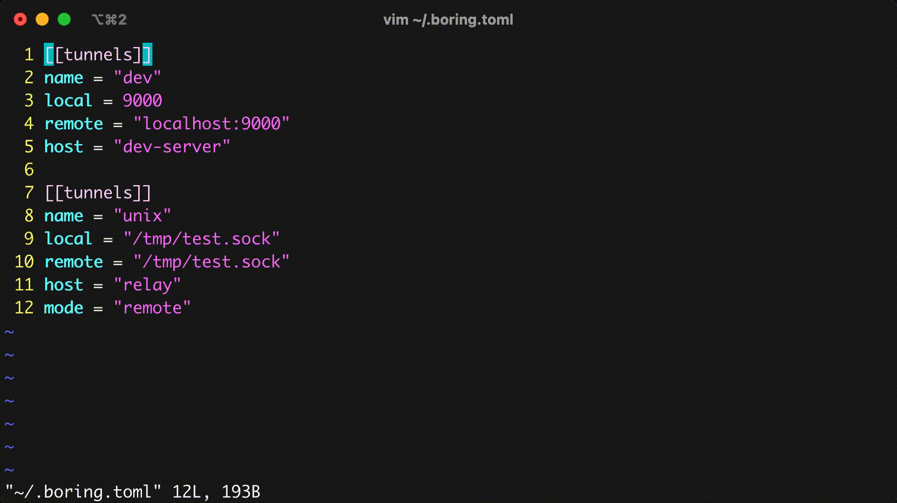

<div align="center">

<h1>The <code>boring</code> tunnel manager</h1>



A simple command line SSH tunnel manager that just works.

[](https://github.com/alebeck/boring/actions/workflows/test_and_cover.yml)
[](https://github.com/alebeck/boring/releases/latest)
[](https://goreportcard.com/report/github.com/alebeck/boring)
[](https://coveralls.io/github/alebeck/boring?branch=main)


Get it: `brew install boring`

</div>

## Demo


## Features

* Ultra lightweight and fast
* Local, remote and dynamic (SOCKS5) port forwarding
* Multiple port forwards over a single SSH connection
* Works with SSH config and `ssh-agent`
* SSH 2FA (keyboard-interactive) and encrypted-key passphrases
* Supports Unix sockets
* Automatic re-connection and keep-alives
* Human-friendly TOML configuration
* Interactive terminal UI (`boring tui`)
* Connection testing (`boring test`)
* Cross platform support
* Smart shell completions

## Usage

```
Usage:
  boring list, l [-g <group>]    List all tunnels
  boring open, o (-a | -g <group> | <patterns>...)
    <patterns>...                Open tunnels matching any glob pattern
    -a, --all                    Open all tunnels
    -g, --group <group>          Open all tunnels in a group
  boring close, c                Close tunnels (same options as 'open')
  boring test, t <patterns>...   Test tunnel connections (SSH handshake + auth)
  boring tui                     Launch the interactive terminal UI
  boring edit, e                 Edit the configuration file
  boring version, v              Show the version number
  boring help, h                 Show this help message
```

## Terminal UI

`boring tui` opens an interactive dashboard for managing tunnels and editing
your configuration — no need to hand-edit `.boring.toml`.

<!-- TUI usage GIF goes here, e.g.  -->

From the dashboard you can:

* See every tunnel with a live, colour-coded status (open / reconnecting /
  needs auth / closed). A multi-forward tunnel shows as a grouped tree, one
  row per forward.
* Open, close, and test connections.
* Add, edit, and delete tunnels through a form — changes are written back to
  `.boring.toml`, and your original file is backed up once as `.boring.toml.bak`.
* Answer 2FA codes and key passphrases in a modal when a tunnel needs them.

| Key | Action |
|-----|--------|
| `j` / `k`, `↑` / `↓` | Move between tunnels |
| `enter` / `space`    | Open / close the selected tunnel |
| `t`                  | Test the selected tunnel's connection |
| `a`                  | Add a new tunnel |
| `e`                  | Edit the selected tunnel |
| `d`                  | Delete the selected tunnel |
| `?`                  | Toggle the help screen |
| `q` / `ctrl+c`       | Quit |

In the add/edit form: `tab` / `shift+tab` move between fields, `←` / `→` cycle
a forward's mode, `ctrl+f` adds a forward and `ctrl+x` removes one, `enter`
saves and `esc` cancels.

## Interactive authentication

`boring` supports SSH keyboard-interactive authentication (2FA) and
passphrase-protected private keys. When a tunnel needs an interactive answer —
a one-time code or a key passphrase — `boring` asks for it instead of failing:

* `boring open` prompts directly on the terminal.
* The `tui` shows a modal dialog for the prompt.

A tunnel that authenticated via 2FA is not silently auto-reconnected, since a
fresh code is required and the background daemon cannot ask for one; it is
shown with a `needs auth` status so you can re-open it.

## Configuration

By default, `boring` reads its configuration from `~/.boring.toml` on macOS and Windows, and from `$XDG_CONFIG_HOME/boring/.boring.toml` on Linux. If `$XDG_CONFIG_HOME` is not set, it defaults to `~/.config`. The location of the config file can be overridden by setting `$BORING_CONFIG`. The config is a simple TOML file describing your tunnels:

```toml
# simple tunnel
[[tunnels]]
name = "dev"
local = "9000"
remote = "localhost:9000"
host = "dev-server"  # automatically matches host against SSH config

# example of an explicit host (no SSH config)
[[tunnels]]
name = "prod"
local = "5001"
remote = "localhost:5001"
host = "prod.example.com"
user = "root"
identity = "~/.ssh/id_prod"  # will try default ones if not set

# ... more tunnels
```

You can edit this file by hand, or let the `tui` manage it for you. When the
TUI saves a change it rewrites `.boring.toml`, and on its first save it
preserves your original hand-written file (including any comments) as
`.boring.toml.bak`.

### Multiple forwards over one connection

A single `[[tunnels]]` entry can carry multiple `[[tunnels.forward]]` blocks.
Each forward is one port forwarding, but they all share **one SSH
connection** — so connecting to several services behind the same host costs
just **one handshake, one authentication, and one 2FA prompt** instead of one
per forward. This is especially handy for 2FA-protected bastions.

```toml
[[tunnels]]
name = "prod"
host = "bastion"
user = "deploy"

  [[tunnels.forward]]
  name   = "db"            # optional label
  local  = "5432"
  remote = "db.internal:5432"

  [[tunnels.forward]]
  local  = "6379"
  remote = "redis.internal:6379"
  mode   = "local"         # optional, default "local"
```

The legacy single-`local`/`remote` form keeps working unchanged — it is simply
a tunnel with exactly one forward, so existing configs need no edits.

Rules: a tunnel must define at least one forward, either via the tunnel-level
`local`/`remote`(/`mode`) shorthand **or** one or more `[[tunnels.forward]]`
blocks — setting both on the same tunnel is an error. A forward's `name`, if
set, must be unique within its tunnel. `boring list` and the `tui` render a
multi-forward tunnel as a grouped tree, one row per forward.

Currently, supported options at tunnel level are:

| **Option**    | **Description**                                                                                                                                                                    |
|---------------|------------------------------------------------------------------------------------------------------------------------------------------------------------------------------------|
| `name`        | Alias for the tunnel. **Required.**                                                                                                                                                |
| `local`       | Local address. Can be a `"$host:$port"` network address or a Unix socket. Can be abbreviated as `"$port"` in local and socks modes. **Required** in local, remote and socks modes. A **per-forward** field: set it at the tunnel level (shorthand for a single-forward tunnel) or inside each `[[tunnels.forward]]`. |
| `remote`      | Remote address. As above, but can be abbreviated in remote and socks-remote modes. **Required** in local, remote and socks-remote modes. Also a **per-forward** field.             |
| `host`        | Either a host alias that matches SSH configs or the actual hostname. **Required.**                                                                                                 |
| `mode`        | Mode of the forward. Can be either `"local"`, `"remote"`, `"socks"` or `"socks-remote"`. Default is `"local"`. Also a **per-forward** field.                                        |
| `forward`     | Optional `[[tunnels.forward]]` array — one block per port forward, each with its own `local`/`remote`/`mode` (and optional `name`). Use it instead of the tunnel-level `local`/`remote`/`mode` shorthand to carry multiple forwards over one connection. The optional per-forward `name`, if set, must be unique within the tunnel. |
| `user`        | SSH user. If not set, tries to read it from SSH config, defaulting to `$USER`.                                                                                                     |
| `identity`    | SSH identity file. If not set, tries to read it from SSH config and `ssh-agent`, defaulting to standard identity files.                                                            |
| `port`        | SSH port. If not set, tries to read it from SSH config, defaulting to `22`.                                                                                                        |
| `group`        | Group that the tunnel is assigned to. Groups are only shown in `list` view if at least one tunnel has a group assigned. Can be used for grouped `open`, `close`, and `list`.                         |

Options that can be provided at global and tunnel level (tunnel level takes precedence):

| **Option**    | **Description**                                                                                                     |
|---------------|---------------------------------------------------------------------------------------------------------------------|
| `keep_alive`  | Keep-alive interval **in seconds**. Default: `120` (2 minutes).                                                     |

You can influence the behavior of `boring` via a couple of environment variables:
<details>
  <summary>Show</summary>

  | **Variable**       | **Description**        | **Default**                                                                        |
  |--------------------|------------------------|------------------------------------------------------------------------------------|
  | `$BORING_CONFIG`   | Config file location   | `~/.boring.toml` (Mac & Windows) and `$XDG_CONFIG_HOME/boring/.boring.toml`(Linux) |
  | `$BORING_LOG_FILE` | Log file location      | `/tmp/boringd.log`                                                                 |
  | `$BORING_SOCK`     | Socket location        | `/tmp/boringd.sock`                                                                |
  | `$DEBUG`           | Enable verbose logging | ` `                                                                                |
    

</details>

## Installation

### Homebrew

```sh
brew install boring
```

### Pre-built

Get one of the pre-built binaries from the [releases page](https://github.com/alebeck/boring/releases). Then move the binary to a location in your `$PATH`.

### Build yourself

```sh
git clone https://github.com/alebeck/boring && cd boring
make
```

Then move the binary in `dist` to a location in your `$PATH`.

<details>
  <summary>Note for Windows users</summary>
  Windows is fully supported since release 0.6.0. Users currently have to build from source, which is very easy. Make sure Go >= 1.25 is installed and then compile via

  ```batch
  git clone https://github.com/alebeck/boring && cd boring
  .\build_win.bat
  ```

  Then, move the executable to a location in your `%PATH%`.
</details>

### Shell completion

Shell completion scripts are available for `bash`, `zsh`, and `fish`.

If `boring` was installed via Homebrew, and you have Homebrew completions enabled, nothing needs to be done.

Otherwise, install completions by adding the following to your shell's config file:

#### Bash

```sh
eval "$(boring --shell bash)"
```

#### Zsh

```sh
source <(boring --shell zsh)
```

#### Fish

```sh
boring --shell fish | source
```
## Further Links
* pkg.go.dev: https://pkg.go.dev/github.com/alebeck/boring
* Coveralls: https://coveralls.io/github/alebeck/boring?branch=main

## Credits
Go gopher logo by Renee French.
